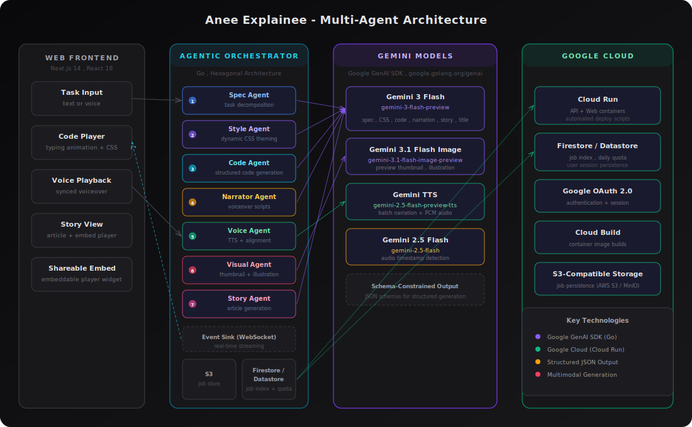

# Anee Explainee

**A multi-agent AI system that autonomously transforms coding tasks into immersive, multimodal walkthroughs — with real-time voice, typing animations, and AI-generated visuals.**

Describe a coding task (text or live voice) and the agentic pipeline decomposes it, generates styled code, produces a synchronized voiceover in your chosen language, creates visual assets, and publishes a shareable interactive player — all streamed in real time.

<p align="center">
  
</p>

## Agentic architecture

The backend runs a **multi-agent orchestration pipeline** where seven specialized agents execute autonomously, each backed by a purpose-selected Gemini model:

| Agent | Gemini Model | Role |
|-------|-------------|------|
| **Spec Agent** | Gemini 3 Flash | Task decomposition — turns a user prompt into a structured spec |
| **Style Agent** | Gemini 3 Flash | Dynamic CSS theming — generates a cohesive code viewer theme |
| **Code Agent** | Gemini 3 Flash | Structured code generation — produces segmented code with schema-constrained JSON output |
| **Narrator Agent** | Gemini 3 Flash | Voiceover scripting — writes per-segment narration in the selected language |
| **Voice Agent** | Gemini TTS + Live API | Audio synthesis — batched TTS with LLM-driven audio timestamp detection for alignment |
| **Visual Agent** | Gemini 3.1 Flash Image | Multimodal image generation — thumbnail + technical illustration (parallel execution) |
| **Story Agent** | Gemini 3 Flash | Article generation — blog-style write-up with embedded interactive player |

The orchestrator chains these agents through an **event-driven architecture** (`EventSink` with typed events: `stage`, `spec`, `css`, `segment`, `audio`, `story`, `visuals`, `code_done`) — streaming results to the frontend in real time over WebSocket. Sub-tasks run with **concurrent execution** (image generation runs in parallel via goroutines with `sync.WaitGroup`; batched TTS uses rate-limited concurrency).

### Key technical patterns

- **Hexagonal / Ports & Adapters architecture** — clean separation of domain logic from infrastructure (`ports/` interfaces, `adapters/` implementations); agents are swappable and testable
- **Schema-constrained structured output** — `genai.Schema` with `ResponseMIMEType: "application/json"` ensures deterministic agentic data flow between pipeline stages
- **Multi-model orchestration** — five distinct Gemini models selected per sub-task for optimal performance (text, code, image, audio, timestamp detection)
- **Human-in-the-loop** — the agent adapts its execution path based on user intent (text vs. voice input, task generation vs. user-code narration mode)
- **Multimodal I/O** — text in, voice in (Live API), code + CSS out, audio out (TTS), image out (generated visuals), HTML out (story article)

## Mandatory tech

- **Gemini 3 Flash** (`gemini-3-flash-preview`) — all text/code/CSS/story generation via Google GenAI SDK (`google.golang.org/genai`). Override with `GEMINI_MODEL`.
- **Gemini Live API** (WebSocket) — real-time bidirectional voice: live voice task input and voiceover output. Override model with `GEMINI_LIVE_MODEL`.
- **Google Cloud** — backend hosted on Cloud Run; Firestore/Datastore for job index and quota; Cloud Build for container images; Google OAuth for auth.

## Quick start

**Environment and deployment:** See [doc/deployment.md](doc/deployment.md) for environment variables (backend and frontend), Cloud Run staging/production deploy, and GitHub Actions.

### 1. Run locally

**Backend (Go):**

```bash
cd api
go mod tidy
go run ./cmd/server
```

Server listens on `:8080` by default.

**Frontend (Next.js):**

```bash
cd web
npm install
# If you see peer dependency conflicts: npm install --legacy-peer-deps
npm run dev
```

Open [http://localhost:3000](http://localhost:3000). Enter a task (e.g. "A React counter with increment and decrement"), choose language, click Generate.

### 2. Run with Docker Compose

From the repo root:

```bash
docker-compose up --build
```

- API: [http://localhost:8090](http://localhost:8090) (mapped `8090:8080`)
- Web UI: [http://localhost:3010](http://localhost:3010) (mapped `3010:3000`)

Set `GEMINI_API_KEY` in the environment or in a `.env` file in the repo root.

For **deployment** (Cloud Run staging/production, GitHub Actions, deploy configs), see [doc/deployment.md](doc/deployment.md).

## Repo layout

- **`api/`** — Go backend: agentic orchestrator, WebSocket `GET /task/stream` (streaming spec/CSS/code/audio + stage events), WebSocket `GET /live` (Live API proxy).
- **`web/`** — Next.js frontend: task input, generation progress (stage labels + %), code view with typing effect, dynamic CSS, voice playback, embed player.
- **`scripts/`** — Fast staging deploy scripts (Cloud Run from source).
- **`deploy/`** — Cloud Run configs: env stubs and Secret Manager links (`env.prod.yaml`), list of [secrets to create](deploy/secrets-to-create.md). Secrets YAML in this directory is encrypted with SOPS.
- **`doc/architecture.md`** — Architecture with Mermaid diagram.
- **`doc/architecture.svg`** — Full architecture diagram (visual).
- **`doc/architecture-backend.svg`** — Backend (orchestrator + Gemini + Cloud) diagram.
- **`doc/architecture-frontend.svg`** — Frontend architecture diagram.
- **`doc/deployment.md`** — Environment variables and deployment (Cloud Run, GitHub Actions).
- **`doc/testing.md`** — Reviewer guide with sample prompts and checklist.

## Architecture diagram

- **Full system:** [`doc/architecture.svg`](doc/architecture.svg)
- **Backend:** [`doc/architecture-backend.svg`](doc/architecture-backend.svg) (orchestrator, Gemini models, Google Cloud)
- **Frontend:** [`doc/architecture-frontend.svg`](doc/architecture-frontend.svg) (Next.js app and data flow)

Mermaid source: [`doc/architecture.md`](doc/architecture.md).

## API summary

| Method | Path | Description |
|--------|------|-------------|
| GET    | `/task/stream` | WebSocket: agentic pipeline stream — emits `stage`, `spec`, `css`, `segment`, `audio`, `story`, `visuals`, `code_done`, `error`. Requires auth when OAuth is configured. |
| GET    | `/live` | WebSocket: proxy to Gemini Live API for real-time bidirectional voice I/O. |
| GET    | `/auth/start` | Redirect to Google OAuth. Query: `redirect` (URL to return to after login). |
| GET    | `/auth/callback` | OAuth callback; sets session cookie and redirects. |
| GET    | `/auth/logout` | Clears session cookie and redirects. Query: `redirect`. |
| GET    | `/me` | Returns `{ sub, email, quotaRemaining }` when signed in; 401 otherwise. |
| GET    | `/jobs/mine` | Returns list of current user's jobs `[{ id, title, createdAt }]`. Requires auth. Query: `limit` (default 50). |
| GET    | `/jobs/recent` | Returns recently created jobs across all users (newest first). Query: `limit` (default 20). |
| GET    | `/jobs/{id}` | Returns job by ID (public; used for permalinks and embed). |

## Auth and jobs

When `GOOGLE_CLIENT_ID`, `GOOGLE_CLIENT_SECRET`, `AUTH_CALLBACK_URL`, and `SESSION_SECRET` are all set, the API requires sign-in for generation:

- Set `AUTH_CALLBACK_URL` to the **frontend** OAuth callback (e.g. `http://localhost:3010/auth/callback` or `https://your-app.com/auth/callback`). Google redirects users there after sign-in; the frontend then sends the auth code to the API to complete login. This way the URL shown on the Google sign-in screen is your app's domain.
- Unauthenticated requests to `GET /task/stream` receive 401.
- The frontend shows "Sign in with Google"; after sign-in, the session cookie is sent with requests (use `credentials: 'include'` and ensure `ALLOWED_ORIGINS` matches the web origin so CORS allows credentials).
- To disable auth even when OAuth vars are set, use `DISABLE_AUTH=yes`.

With a job index configured, job metadata (owner, title, createdAt) is written on each upload. The "My jobs" sidebar calls `GET /jobs/mine` to list the current user's jobs.

- **Firestore (Native):** set `FIRESTORE_PROJECT_ID` (and optionally `FIRESTORE_DATABASE_ID`). Create a composite index: collection `jobs`, fields `ownerSub` (Ascending) and `createdAt` (Descending). The Firebase console will prompt with a link when the first query runs.
- **Datastore / Firestore in Datastore mode:** set `DATASTORE_PROJECT_ID` when your database is in Datastore mode (the Cloud Firestore API is not available for that database). Set `DATASTORE_DATABASE_ID` to your named database (e.g. `code-commenter`); omit for the default database. Create a composite index: kind `Job`, properties `ownerSub` (Ascending) and `createdAt` (Descending). Use `gcloud datastore indexes create api/index.yaml --project=YOUR_PROJECT_ID` (add `--database=YOUR_DATABASE_ID` for a named database) or the link from the first-query error in the console.

## Embeddable job player

You can embed a previously generated job player on any site using one script.

### Script usage

```html
<div id="my-player"></div>
<script
  src="https://your-web-domain.com/embed-player.js"
  data-code-commenter-embed
  data-job-id="YOUR_JOB_UUID"
  data-target="#my-player"
  data-width="100%"
  data-height="640"
></script>
```

Supported script attributes:

- `data-job-id` (required): job UUID to render.
- `data-target` (optional): CSS selector for mount element. If omitted, a mount node is inserted after the script tag.
- `data-width` (optional): iframe width (`100%`, `900px`, etc). Default `100%`.
- `data-height` (optional): iframe height in px or CSS units. Default `640`.
- `data-min-height` (optional): minimum iframe height. Default `360`.
- `data-autoplay` (optional): `true`/`1` to append autoplay hint.

You can also pass the job id in the script URL query:

```html
<script src="https://your-web-domain.com/embed-player.js?jobId=YOUR_JOB_UUID"></script>
```

### Deployment requirements

- Web app serves `embed-player.js` and the embed route `/embed/{jobId}`.
- Frontend env: `NEXT_PUBLIC_API_URL` points to your API deployment.
- API env: `ALLOWED_ORIGINS` includes your web domain origin (and any local dev origin you need), for example:

```bash
ALLOWED_ORIGINS=https://your-web-domain.com,http://localhost:3000
```

If a job cannot be loaded, the embed route shows an in-frame error message.

## Gemini models used

| Model | Default ID | Purpose |
|-------|-----------|---------|
| **Gemini 3 Flash** | `gemini-3-flash-preview` | Task spec, CSS, code segments, narration, story, title (`GEMINI_MODEL`) |
| **Gemini 3.1 Flash Image** | `gemini-3.1-flash-image-preview` | Preview thumbnail + illustration image generation |
| **Gemini Live API** | `gemini-2.5-flash-native-audio-preview-12-2025` | Real-time bidirectional voice I/O (`GEMINI_LIVE_MODEL`) |
| **Gemini TTS** | `gemini-2.5-flash-preview-tts` | Batch text-to-speech for voiceover (`GEMINI_TTS_MODEL`) |
| **Gemini 2.5 Flash** | `gemini-2.5-flash` | Audio timestamp detection for segment alignment (`TIMESTAMP_MODEL`) |

## Tech stack

| Layer | Technology |
|-------|-----------|
| **Backend** | Go 1.25, `google.golang.org/genai` v1.48.0, Gorilla WebSocket, Chroma syntax highlighter |
| **Frontend** | Next.js 14, React 18, Tailwind CSS, DOMPurify |
| **Cloud** | Google Cloud Run, Firestore / Datastore, Cloud Build, Google OAuth 2.0 |
| **Storage** | S3-compatible (AWS S3 or MinIO) for job persistence |
| **Testing** | Vitest (frontend) |

For how to run and verify the app locally and in CI, see [doc/testing.md](doc/testing.md).
