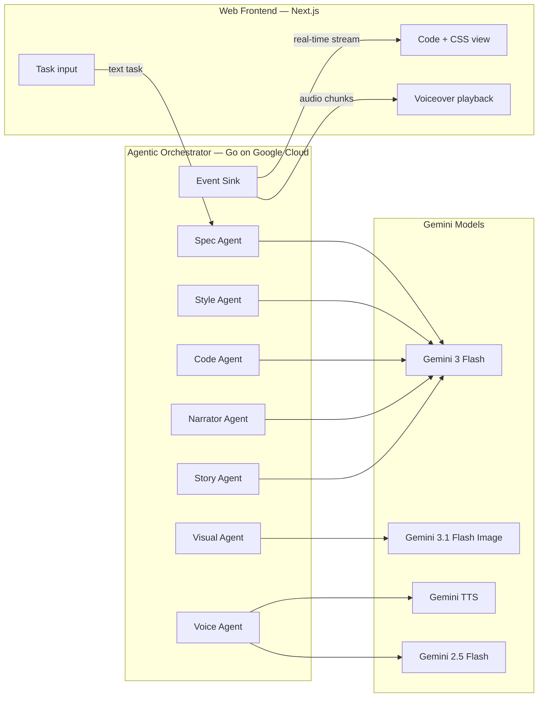

# Anee Explainee — Architecture

## Overview

Anee Explainee is a multi-agent AI system. Users describe a coding task (text), and an agentic orchestration pipeline autonomously generates structured code with dynamic CSS, synchronized voiceover, AI-generated visuals, and a shareable story article — all streamed in real time.

## Mandatory tech

- **Gemini 3 Flash** (`gemini-3-flash-preview` by default) for all text/code/CSS/story generation via Google GenAI SDK. Override with `GEMINI_MODEL`.
- **Google Cloud** for hosting the backend (Cloud Run), job index (Firestore/Datastore), and container builds (Cloud Build).

## Architecture diagram

- **Full system:** [architecture.svg](architecture.svg)
- **Backend:** [architecture-backend.svg](architecture-backend.svg) (orchestrator, Gemini models, Google Cloud)
- **Frontend:** [architecture-frontend.svg](architecture-frontend.svg) (Next.js app and data flow)

  

## High-level architecture

## Agentic pipeline — data flow

1. **Task input:** User enters text.
2. **Spec Agent** (Gemini 3 Flash): Decomposes the task into a structured spec + narration script.
3. **Style Agent** (Gemini 3 Flash): Generates a cohesive CSS theme for the code viewer.
4. **Code Agent** (Gemini 3 Flash): Produces segmented code with per-segment narration using schema-constrained structured output (`genai.Schema` with `application/json`).
5. **Narrator Agent** (Gemini 3 Flash): Generates wrapping narration that summarizes the walkthrough.
6. **Voice Agent** (Gemini TTS + 2.5 Flash): Batched TTS synthesis for all narrations, then LLM-driven audio timestamp detection to split audio at segment boundaries. Alignment service syncs code segments to audio.
7. **Visual Agent** (Gemini 3.1 Flash Image): Generates a video thumbnail and a technical illustration in parallel (`sync.WaitGroup` goroutines).
8. **Story Agent** (Gemini 3 Flash): Produces an HTML article with an embedded player marker (`{{EMBED_PLAYER}}`).
9. **Persistence:** Job is uploaded to S3-compatible storage; metadata indexed in Firestore/Datastore.

All stages emit typed events through the **Event Sink** (WebSocket): `stage`, `spec`, `css`, `segment`, `audio`, `story`, `visuals`, `code_done`.

## Components

| Component        | Role                                                                 |
|-----------------|----------------------------------------------------------------------|
| **Frontend**    | Next.js app: task form, code view with typing effect, dynamic CSS, voice playback, embed player. |
| **Orchestrator** | Go backend: agentic pipeline with hexagonal architecture (ports/adapters). Coordinates seven specialized agents. |
| **Gemini 3 Flash** | Text/code/CSS/story generation via GenAI SDK. Schema-constrained structured output. |
| **Gemini 3.1 Flash Image** | Multimodal image generation (thumbnail + illustration). |
| **Gemini TTS** | Batch text-to-speech (`gemini-2.5-flash-preview-tts`). |
| **Gemini 2.5 Flash** | Audio timestamp detection for segment-level alignment. |
| **Session store** | In-memory store keyed by job ID. |
| **Job store** | S3-compatible storage for persistent job data (code, audio, CSS, story). |
| **Job index** | Firestore or Datastore for job metadata (owner, title, createdAt) and daily quota. |

## API

- `GET /task/stream` — WebSocket. Client sends JSON with `task`, `language`, optional `code` (user-code mode). Server streams `stage`, `spec`, `css`, `segment`, `audio`, `story`, `visuals`, `code_done`, `error`.
- `GET /jobs/{id}` — Public job retrieval for permalinks and embed.
- `GET /jobs/mine` — Authenticated: list current user's jobs.
- `GET /jobs/recent` — List recently created jobs across all users.

## Environment

- **Backend:** `GEMINI_API_KEY` or `GOOGLE_API_KEY`, optional `PORT`, `GEMINI_MODEL`, `GEMINI_TTS_MODEL`, `TIMESTAMP_MODEL`, `ALLOWED_ORIGINS`, `DISABLE_AUTH`.
- **Frontend:** `NEXT_PUBLIC_API_URL` (backend URL for API and WebSocket), or runtime `config.json`.

## Deployment

- Backend: containerize with Dockerfile, deploy to Cloud Run. Automated via `scripts/deploy-cloudrun-api.sh`.
- Frontend: Next.js standalone build, deploy to Cloud Run. Automated via `scripts/deploy-cloudrun-web.sh`.
- Full deploy: `scripts/deploy-cloudrun.sh [GCP_PROJECT_ID]` deploys both and wires CORS.
