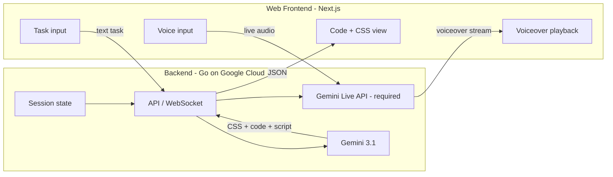

# Code Commenter Live Agent — Architecture

## Overview

Code Commenter is a hackathon-compliant web app where users describe a coding task (text or live voice), receive dynamically generated CSS and code with a typing effect and Gemini Live API voiceover.

## Mandatory tech

- **Gemini 3 Flash** (`gemini-3-flash-preview` by default) for all text/code/CSS generation (task spec, CSS, code, diff). Override with `GEMINI_MODEL`.
- **Gemini Live API** (WebSocket) for real-time voice: live voice task input and/or voiceover output.
- **Google Cloud** for hosting the backend (e.g. Cloud Run).

## High-level architecture

## Data flow

### First run

1. **Task input:** User enters text (or uses live voice via WebSocket to backend → Gemini Live API for transcript).
2. **Backend:** WebSocket `GET /task/stream` with task/language/code. Backend streams: spec, CSS, code segments, and TTS audio for voiceover. Stages (e.g. "Generating task spec", "Generating voiceover") are emitted for progress.
3. **Voiceover:** Backend generates narration and TTS per segment; audio is streamed to the client. Frontend can also use `GET /live` (WebSocket proxy to Gemini Live API) for real-time voice.
4. **Response:** Streamed events (`stage`, `spec`, `css`, `segment`, `audio`, `code_done`). Frontend injects CSS into `#dynamic-theme`, renders code with a typing effect, and plays voiceover in sync with segments.

## Components

| Component        | Role                                                                 |
|-----------------|----------------------------------------------------------------------|
| **Frontend**    | Next.js app: task form, code view with typing effect, dynamic CSS, Live WebSocket for voice. |
| **Backend**     | Go HTTP server: WebSocket `GET /task/stream`, `GET /live` (WebSocket proxy to Live API). |
| **Gemini 3.1**  | All generation: spec, CSS, code. |
| **Live API**    | Real-time voice in/out over WebSocket (mandatory); proxied by backend so API key stays server-side. |
| **Session store** | In-memory store keyed by task `id` (MVP); can be replaced by Firestore/Cloud SQL later. |

## API

- `GET /task/stream` — WebSocket. Client sends JSON with `task`, `language`, optional `code` (your code mode). Server streams `stage`, `spec`, `css`, `segment`, `audio`, `code_done`, `error`.
- `GET /live` — WebSocket upgrade. Server proxies to Gemini Live API; client sends/receives Live API message format (setup, realtimeInput, server content).

## Environment

- **Backend:** `GEMINI_API_KEY` or `GOOGLE_API_KEY`, optional `PORT`, `GEMINI_MODEL`, `GEMINI_LIVE_MODEL`, `ALLOWED_ORIGINS`.
- **Frontend:** `NEXT_PUBLIC_API_URL` (backend URL for API and WebSocket).

## Deployment

- Backend: containerize with Dockerfile, deploy to Cloud Run (or GKE).
- Frontend: build `next build`, static export or run on Node/Cloud Run; set `NEXT_PUBLIC_API_URL` to backend URL.
